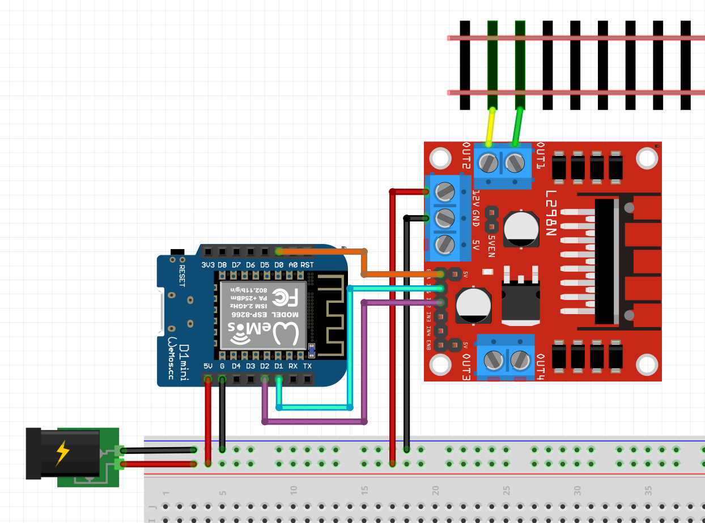

# T Gauge ESP8266 Train Interface
## Parts needed:
* [D1 mini](https://amzn.to/3Rty8ny)
* [L298N Motor Driver](https://amzn.to/3GV3A9p)
* [Power Distribution Board](https://amzn.to/3RVmvqY)
* [Jumper Wire](https://www.amazon.de/Female-Female-Male-Female-Male-Male-Steckbr%C3%BCcken-Drahtbr%C3%BCcken-bunt/dp/B01EV70C78?__mk_de_DE=%C3%85M%C3%85%C5%BD%C3%95%C3%91&crid=11ZJPAH13WTP&keywords=steck+kabel&qid=1703532073&sprefix=steck+kabel%2Caps%2C106&sr=8-5&linkCode=sl1&tag=dante1349-21&linkId=9d7f0c36daeacd3030640a6da1e3fb20&language=de_DE&ref_=as_li_ss_tl)
* [Power outlet](https://amzn.to/3TB5LXm)
* [5V Power Supply](https://amzn.to/41D6kSH)

## Installation
* install node: https://nodejs.org/en/download
* install @angular/cli: https://angular.io/cli
* install platformio cli: https://docs.platformio.org/en/stable/core/installation/index.html
* Connect D1Mini ord D1MiniPro
* run in terminal "./uploadToD1.sh"

# Pin config (D1 mini)
* *D0* PWM pin
* *D1* H-Bridge Pin 1
* *D2* H-Bridge Pin 2

## Usage
* Look for WiFis and Connect to the "T-Gauge-Server-AP" Access Point. Enter Your WiFi crendentials. The AP will automatically connect to your wifi.
* Find the "T-Gauge-Server" IP adress in your Router.
* Open a browser and use the ip like following:
  * http://*IP*/
